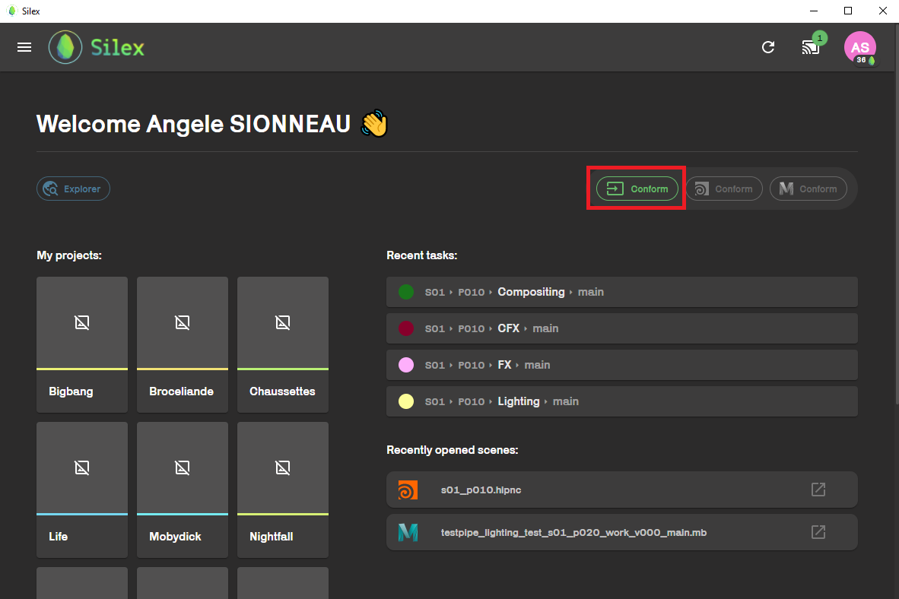
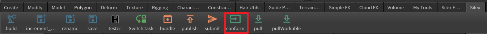
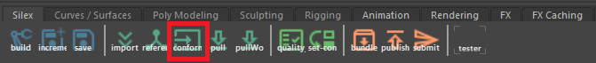
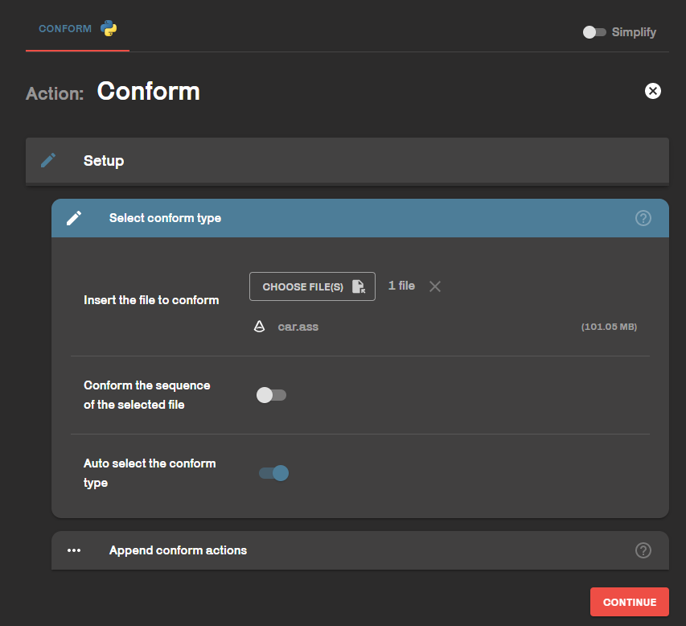

To conform = Include your scenes and assets in the pipeline.
## In Silex

Conform button is in the home page.
## In houdini

Conform button is in the silex shelf.
## In Maya
             
Conform button is in the silex shelf.
## Action
        
When you click on conform button, you are simply asked which file you want to conform. Then, to wich shot or asset your want to link it.
If **Auto select the conform type** is enable, Silex will automatically set your file according to its extension. But if you have any bugs, please disable it.