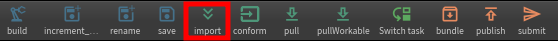
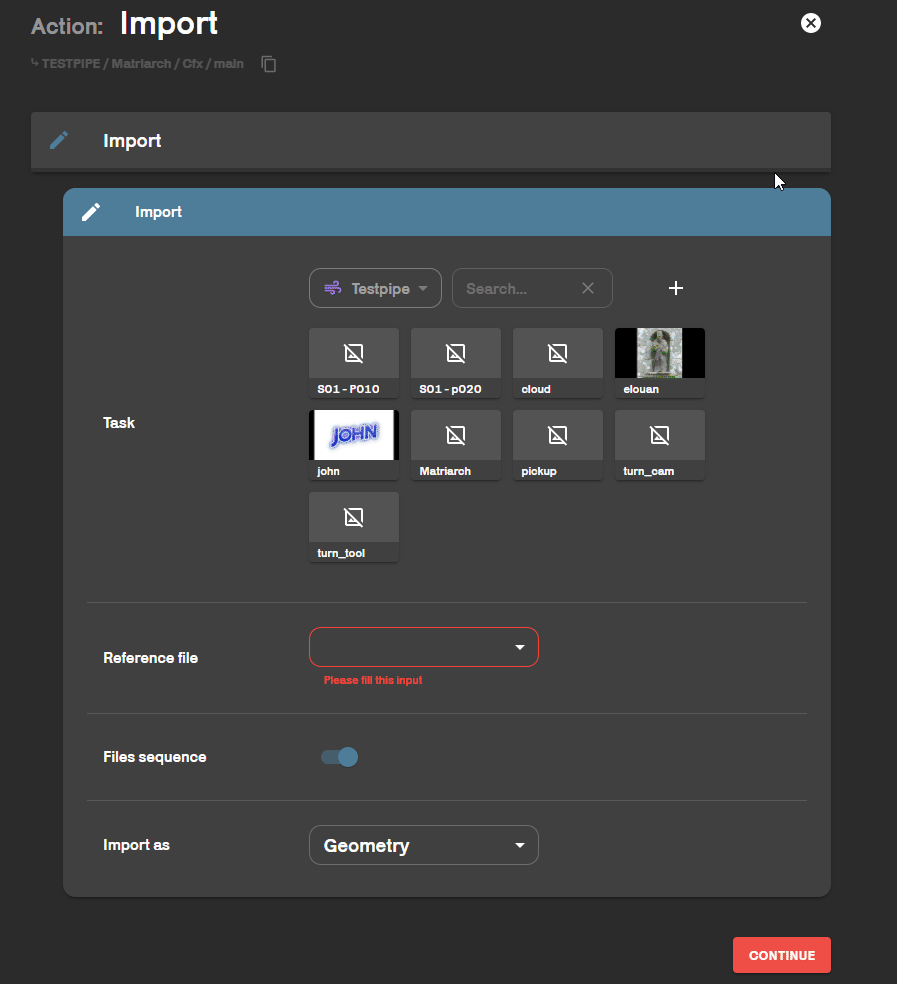
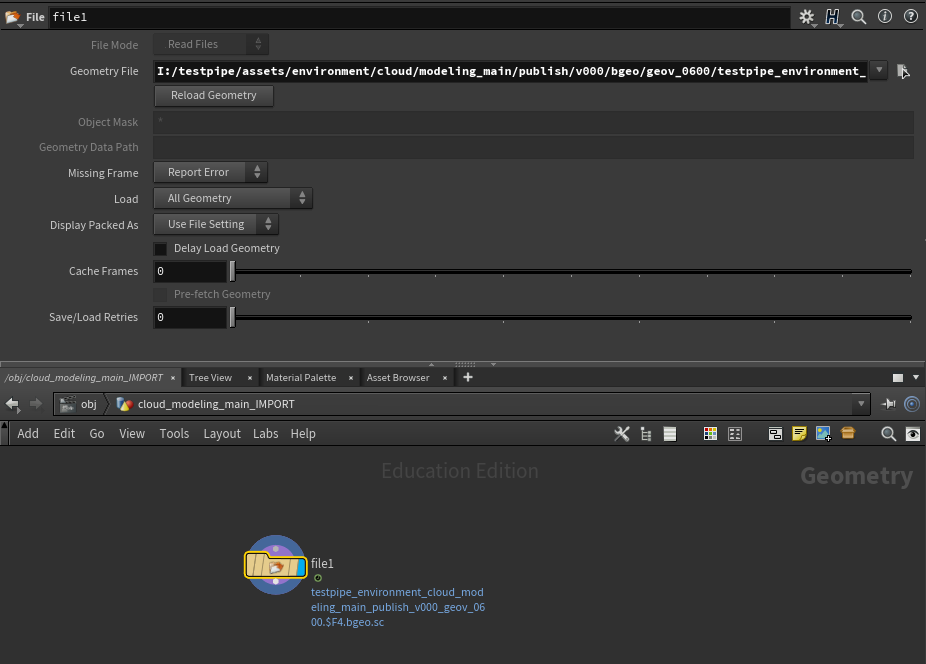
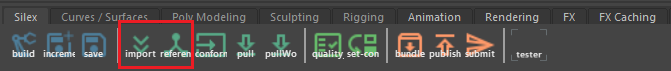
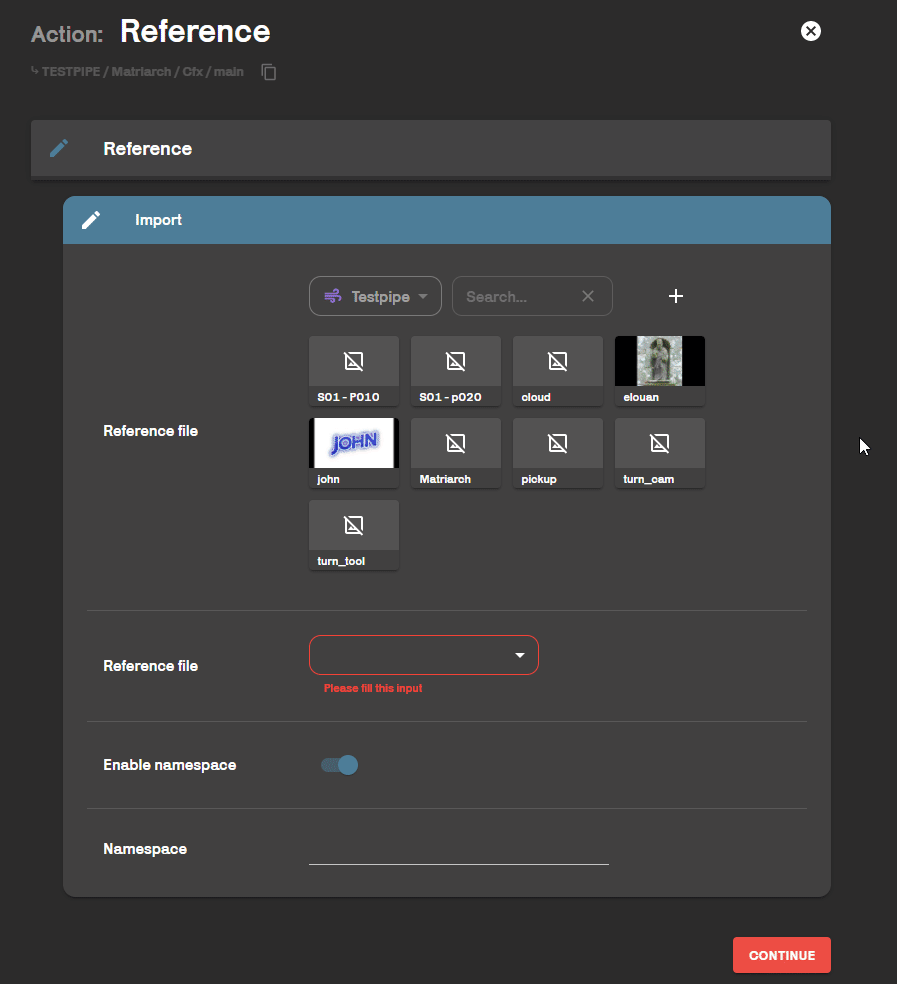

This action lets you import publish into your scenes. Instead of going to the server and importing your files by hand, you simply tell silex which task you want to import.

## In Houdini
                         
From your houdini work file, simply go to the silex shelf and click on the import button.
At this moment you can import as :
- Geometry
- Alembic scene
- Arnold Procedural
- Arnold Volume
Send a [ticket](../../interface/tickets.md) to the TD Gang if you need another type of import.

             
Choose the file you want to import.
If it is a image sequence, keep activate the toggle **Files sequence**.
**Import as** allows you to choose the import type. In this example I import .begeo.sc so I keep *Geometry*.

My image sequence was successfully imported.

## In Maya
                       
From your maya work file, you can find the import button and the reference button.                  
To exploit the power of the pipeline to its full potential, import as a reference rather than importing at all.

                           
Choose the file you want to import.                 
We recommend that you choose a namespace.  
