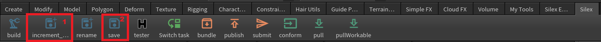
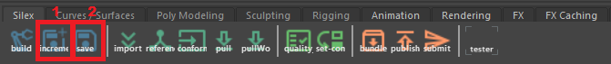
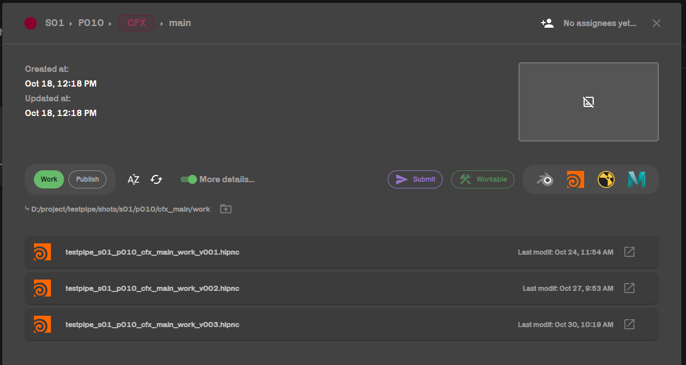

Do we really have to explain what **save** means?

## In Houdini
           
In the silex shelf, **1** is increment save, **2** is save.

## In Maya
             
In the silex shelf, **1** is increment save, **2** is save.

## Save
Your work files are saved in the hierarchy as follows:
- shot : ```D:/project/{pfe}/shots/{sequence}/{shot}/{task}/work/{pfe}_{sequence}_{shot}_{task}_work_{version}.{extension}```
- asset : ```D:/project/{pfe}/assets/{asset type}/{asset name}/{task}/work/{pfe}_{asset type}_{asset name}_{task}_work_{version}.{extension}```

For example, this means that the cfx file for shot 01-010 can be found here : ```D:/project/testpipe/shots/s01/p010/cfx_main/work/testpipe_s01_p010_cfx_main_work_v001.hipnc```

As you can see, the file has a version. If you work on your file and click on **save** button, your updates will be saved on the same file. If you click on **increment save**, a new version will be created. Example : testpipe\_s01_p010_cfx_main_work\_**v001**.hipnc will become testpipe\_s01_p010_cfx_main_work\_**v002**.hipnc.

          
You can see all your versions in silex and acces to any of it.