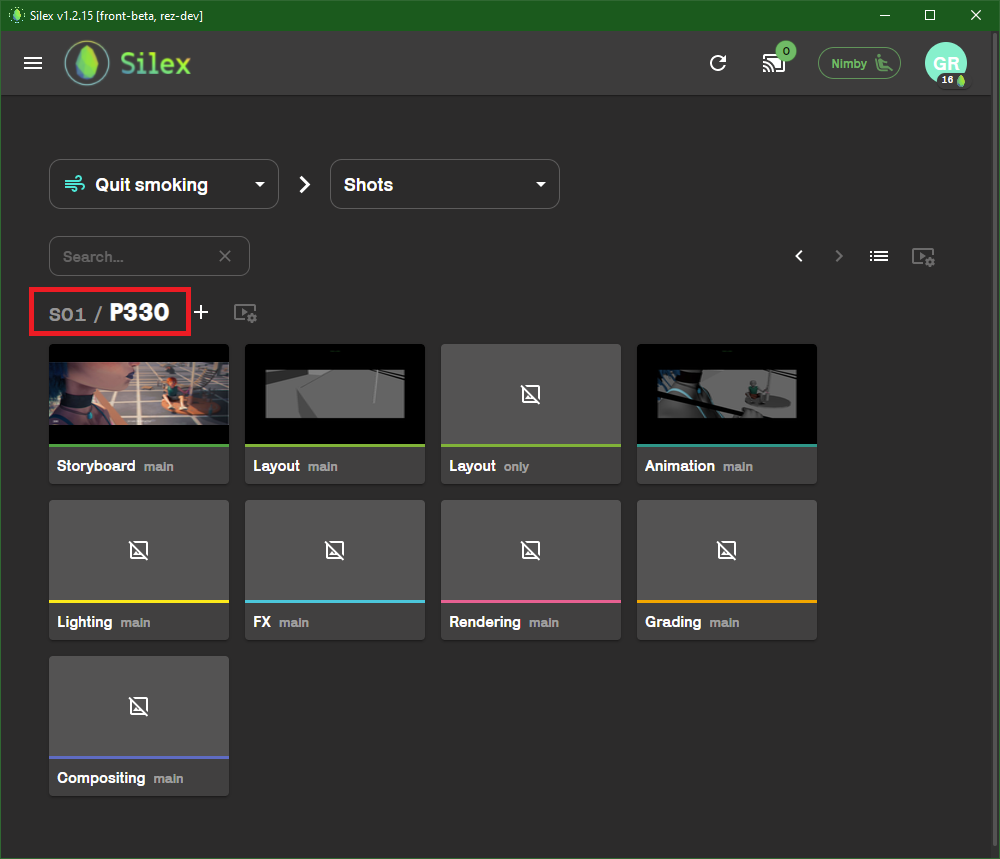
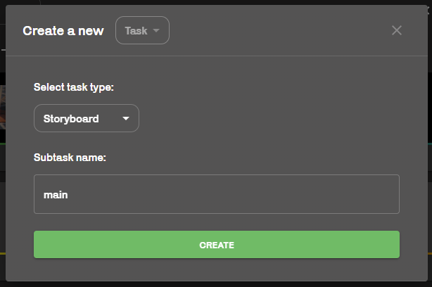

## publish / work

### What is a Work folder ? :

The Work folder is accessible from the interface as you can see [here](../interface/file-explorer.md). thise is a free space for you to save scenes in progress. It is a folder that is not backuped on the server, and only exists in your computer. This is where you save your scene and incremented versions.

### A pick in the Publish folder :

The __Publish__ is probably the most important concept to grasp in a pipeline. When a scene is published, it means the scene is "finished", or in it's "final version" and ready for the next stage in the pipeline. This goes for every departement, but a published file is a little bit more than that and if we want to understand what it really is, we need more knoledge on how it works. 

This is important knowledge to have, and will be usefull for other concepts and services on Silex or in other pipelines. So read carefully 👀.

You see, working in a pipeline usually means, __working with a server__. To keep it simple, i'll go straight to the point and try to avoid unnecessary details. In Silex, we use a server "connected"" to every computer in school ( there are actually 2 servers, but for the sake of this explaination, let's say there is only one ok ? :) ). Since the server is accessible by every computers in Artfx, every files stored in it can be accessed from __anywhere__ 🌍 .

When you put a file in a __publish__ folder, this folder is synchronised on the server and can be accessed by any computer.Got it ? So this also means that the [renderfarm](../renderfarm/renderfarm.md) knows where the file is and can render it in the case of Maya scene, Houdini scene, vrscene ... 

( I encourage reading the documentation on the [renderfarm](../renderfarm/renderfarm.md) 🚜 for more details. )

FURTHERMORE ! To be able to render a scene on the [renderfarm](../renderfarm/renderfarm.md), we also need every textures or references to be accessible on the server. This is the tricky part, and the [publish tool](./actions/publish.md) ensures that every files linked, in any way, to the published file is also copied on the server. That's a second important aspect of the __Publish__.

:::note
<u>So, to summerize :</u>

- A published file (a file exported to the publish folder by Silex's [publish tool](./actions/publish.md)) is accessible __anywhere__ as well as it's references, textures, etc... . 

- A published file is only the finale version of your work. 

(there will be a full, step by step, example later.)
:::

## context + tasks

Another important concept in Silex, is the concept of __task__ and __context__.

Here in this picture, we just clicked on the shot 330 (ass you can see in the red). Inside you can see all the different __tasks__ assigned to this shot. (__Tasks__ are the equivalent of departements in a vfx/3D studio 🦉)

For exemple : Layout, lookdev...

You can add a new custom task to the list by clicking on the "+" button near the shot name. Then fill in the pop up window :

:::caution
The list of tasks is defined by the supervisors before the project begins.
:::

Now, let's say you are a layut artist. afetr selecting your Shot or Asset in the explorer, you can selecte the task __Layout__, and [open a new scene](../interface/file-explorer.md) from the launch window. the new scene is now open in a __Context__ specific to this task. this means that the [tools in the Silex shelf](./actions/actions.md) will take into acount that your are in a layout scene in for the shot you selected. In other terms, Silex KNOWS where youo are,  and will use i for publishing files.

As mentioned before, the [publish tool](./actions/publish.md) exports the scene or the selection into a publish folder. Since you work in a __Layout__ scene, if you use the [publish tool](./actions/publish.md), the exported files will be accessible in the publish folder. You will be able to access it ONLY in this particular task, in this particular shot. 

( To see published files, se the related section in [Browsing through files](../interface/file-explorer.md) )

## workflow exemple step by step :

