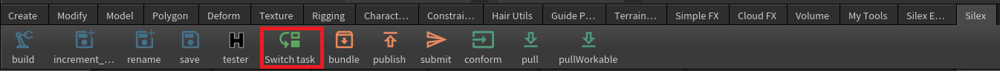
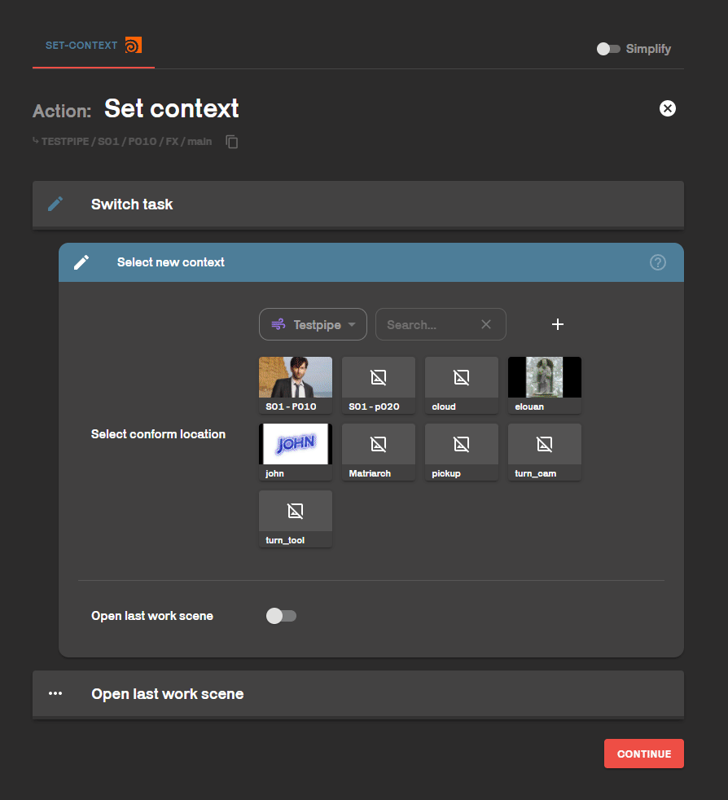

# Convert scene to another task

Situation : You are a FX artist, you have done an FX for the shot s01p010 but you wan to use it as a base for your s01p020 shot.

1 : Open your s01p010 FX scene.             

2 : [Save](../actions/save.md) your scene **and** increment save your scene. Your scene name must be the name of your initial scene (in our example, s01p010 fx).               

3 : 

Use the tool switch task!
      
The tool ask you to wich task you want to convert your current scene. In my example, I select the s01p020 FX task.

4 : Finally, [save](../actions/save.md) again with the silex save tool. Now, your scene is set for another task, at the right place in the pipeline.
