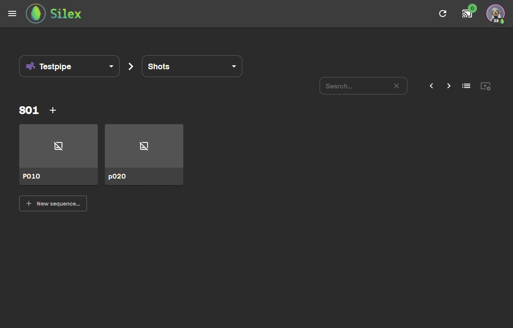

# Create a new scene

Situation : You are an animator and you have to start to animate a shot.

1 :

First, go to your shot in the [file explorer](../../interface/file-explorer.md) and click on the task animation. To open a new scene, you just have to click on a software in the area next to the workable button.

2 : When your scene is open, you can save it at the right place by using the [save tools](../actions/save.md).

3 : Now, you just have to import as reference your rig and the other assets you need by using the [import/reference tools](../actions/import.md).