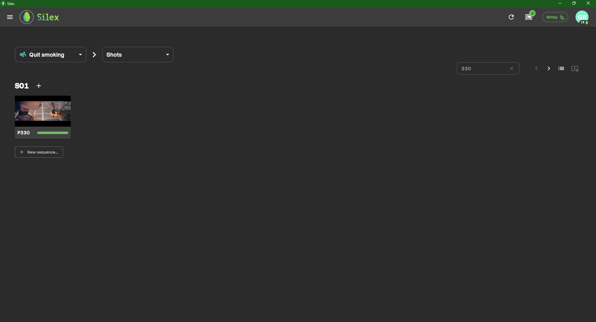
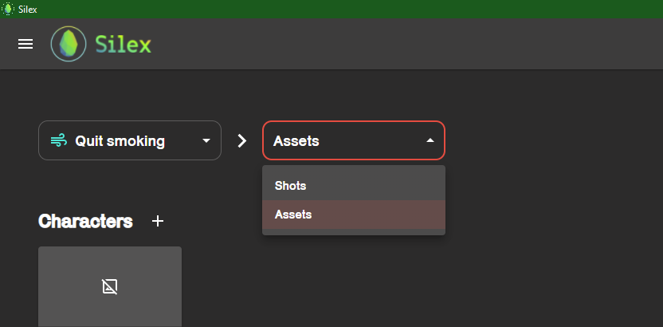
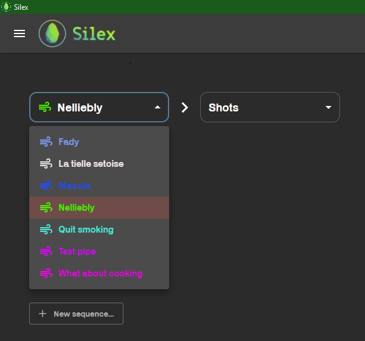
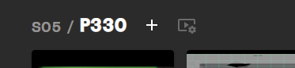
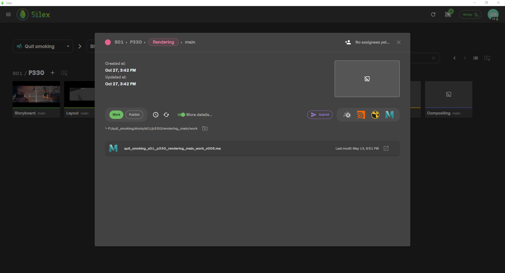
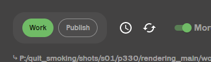
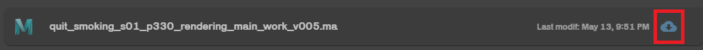
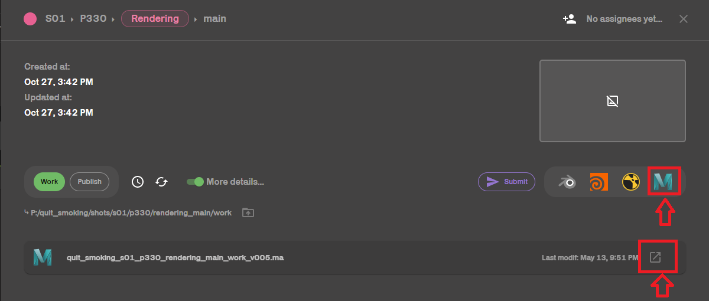

The file explorer allows you to browse your projects.

Here is what it looks like :

This is the view of your sequences but you can also access yours assets in the menu :

For specialists students with multiple projects, you can also switch projects.

## Browsing through files :

When you click on a sequences, you will get "inside" it et access your shots. exactly like a windows file explorer.

when selecting a __Shot__ or an __Asset__, however, you will see a window displayed on you screen. This window shoews the content of your work and publish folder, as well as a capture of you scene (If you took one when publishing it)

you can switch from the __Work__ folder to the __Publish__ folder here :

And Pull a published file from the __Publish__ to the __Work__ folder :

(for more info on work and publish, see : [work-and-publish](../basic-concepts/work-and-publish.md))

In the __Work__ folder, you can either open a new scene or an already existing one.

