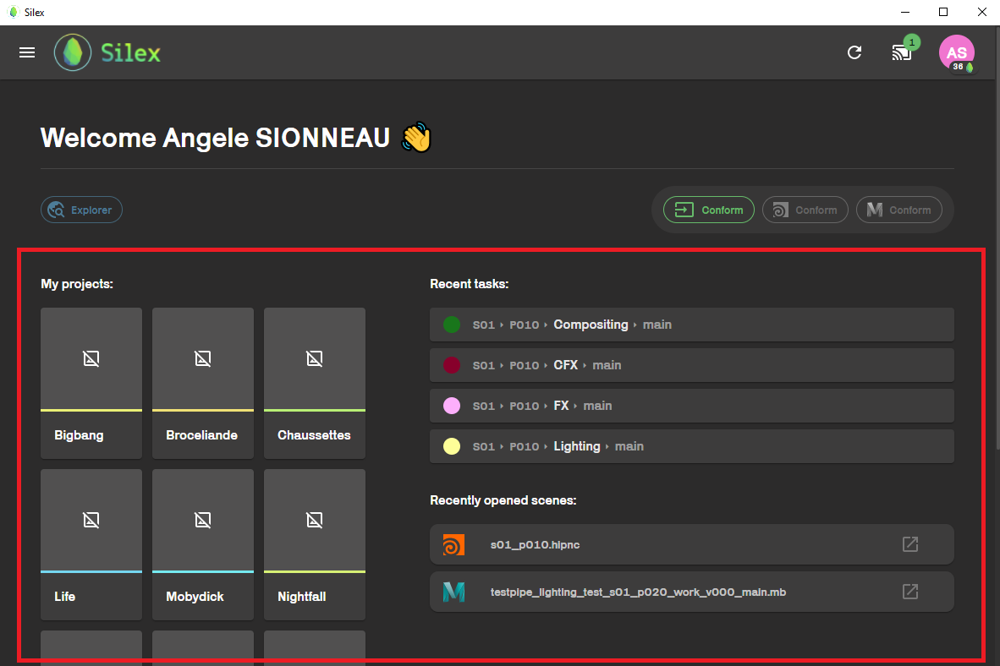

## Home page

---

Hello newbie ! 🖖

Welcome to Silex, a pipeline application which gives you access to the render farm and allows you to browse through your shots and assets and many other things ! (you will see it's very fun)

When opening silex, you just need to connect with your kitsu acount.
after that, the home page will be displayed.

There are three main parts to this home page.

### The bottom part :

It displays shortcuts to shots / assets / projects :

- The **left** side is for the project your are a part of. by licking on one, you will be redirected to the [file explorer](file-explorer.md) within silex, where you wil be able to browse through the project.

- The **center** end **right** side, are shortcuts to the recently opend tasks and scenes.

:::tip
If you are a specialist, you might have multiple projects on the left. If you ever need to be added to another project during the year, go and ask a TD to add you to a group.
:::

### The middle part :

This is a quick access to the _hamberger_ menu on the top left corner in yellow. On the right side you can also access the conform action for simplpe files like textures. ( ⚠️ This conform action will not work with Houdini and Maya files ⚠️ )

This icones are differents application you can acces in Silex. They will be explained in the dedicated subsections at the end of this document.

### The top bar :

This section displays your account avatar, the nimby status, access to the list of currently running applications, an update button and the hamberger menu (previously mentioned).

1- Hamberger menu.

2- Update bottun : reload the interface (usefull if some nexley created files don't show or if new features don't appear) You can use the **very precious** CTRL + R shortcut to trigger the same result.

3- List of running software

<<<<<<< Updated upstream
4- Nimby : allows you to turn on/off the [nimby](nimby.md)

# 5-

4- Nimby : allows you to turn on/off the [nimby](nimby.md).

5- Account profile

## Hamburger menu :

This menu gives you acces to all the service on Silex.

- **Home** : home page

- **Project explorer** : This is a [file explorer](file-explorer.md) that let you browse through the files in your projects.
- **Actions** : This shows all running [actions](../basic-concepts/actions.md) on you computer.

- **Statistics** : This represents the rendered frames progression of each team through the year. Try and reach the top ass fast as you can :)

- **Arcade** : Here you can find flappy-bird like games, inspired by promo2022 movies. plays them to get some silex coins ! (But not to much)

- **Tractor** : Tractor is the school [renderfarm](../renderfarm/renderfarm.md).

- **Harvest** : This will redirect you to [Harvest](../harvest/harvest.md), a statistic tool relaying different information on the renderfarm.

- **Ticket** : Access to the ticket system. see with the TDs if they are using it.
  > > > > > > > Stashed changes
