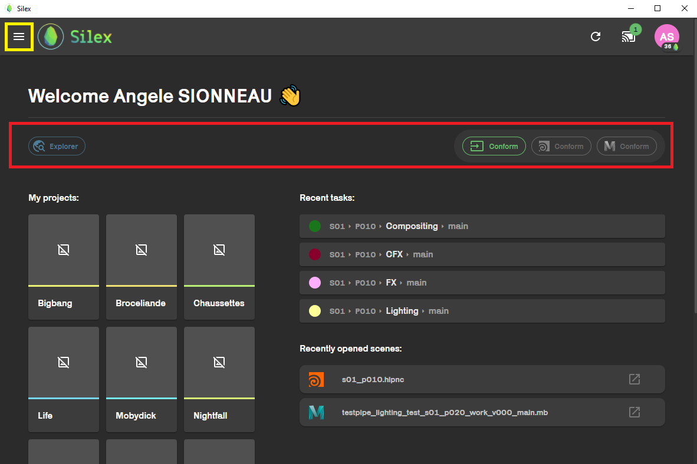
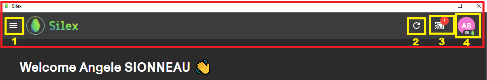

## Home page

---

Hello newbies ! 🖖

Welcome to Silex, a pipeline application which gives you access to the render farm and allows you to browse through your shots and assets, and many other things ! (you'll see, it's very fun)

When opening silex, you just need to connect with your kitsu acount.
after that, the home page will be displayed.

There are three main parts to this home page.

### The bottom part :

It displays shortcuts to shots / assets / projects :

- The **left** side is for the project your are a part of. By clicking on one of them, you will be redirected to the [file explorer](file-explorer.md) within silex, where you will be able to browse through the project.

- The **center** and the **right** side, are shortcuts to the recently opend tasks and scenes.

:::tip
If you are a specialist, you probably have multiple projects on the left. If you ever need to be added to another project during the year, go and ask a TD to add you to a group (They are very nice, you'll see).
:::

### The middle part :

This is a quick access to the _hamberger_ menu on the top left corner (in yellow on the picture). On the right side, you can also access the [conform](../basic-concepts/actions/actions.md) action for simple files like textures. ( ⚠️ This conform action will not work with Houdini and Maya files ⚠️ )

This icones represent different applications you can acces in Silex. They will be explained in the dedicated subsections at the **end** of this document.

### The top bar :

This section displays your account avatar, the nimby status, access to the list of currently running applications, an update button and the hamberger menu (previously mentioned).

1- Hamberger menu.

2- Update button : Reload the interface (useful if some newly created files don't show or if new features don't appear). You can use the **very precious** CTRL + R [shortcut](../shortcuts.md) to trigger the same result.

3- List of running software :

4- Nimby : allows you to turn on/off the [nimby](nimby.md).

5- Account profile :

Silex has coins system. points you can gather when publishing, conforming...

## Hamburger menu :

This menu gives you acces to all the services on Silex.

- **Home** : home page

- **Project explorer** : This is a [file explorer](file-explorer.md) that let you browse through the files in your projects.
- **Actions** : This shows all running [actions](../basic-concepts/actions/actions.md) on you computer.

- **Statistics** : This represents the rendered frames progression of each team through the year. Try and reach the top ass fast as you can 📈.

- **Arcade** : Here you can find flappy-bird like games, inspired by promo2022 movies. Play them to win some silex coins ! (But not to much)

- **Tractor** : Tractor is the school [renderfarm](../renderfarm/renderfarm.md).

- **Harvest** : This will redirect you to [Harvest](../harvest/harvest.md). A statistic tool relaying different information on the renderfarm.

- **Ticket** : Access to the ticket system. see with the TDs if they are using it.
