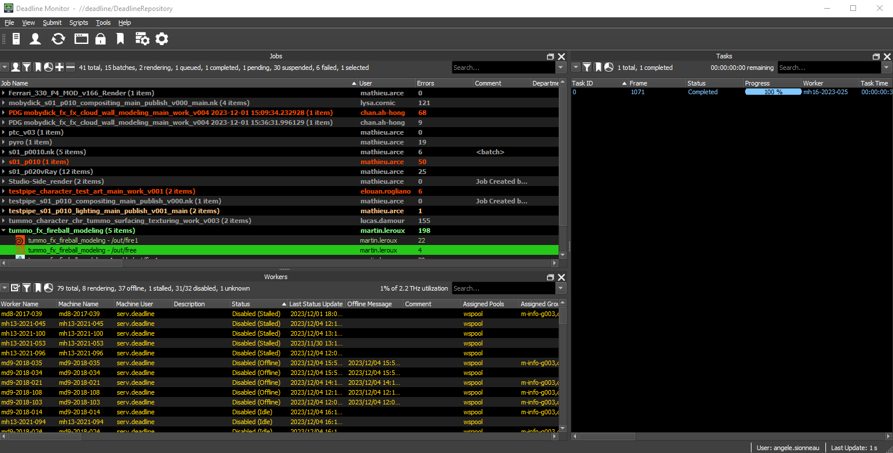
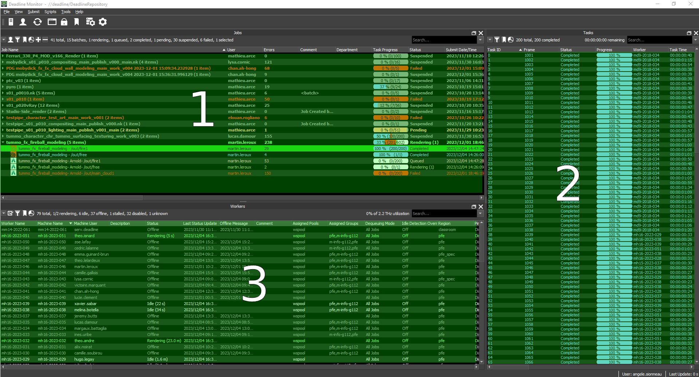
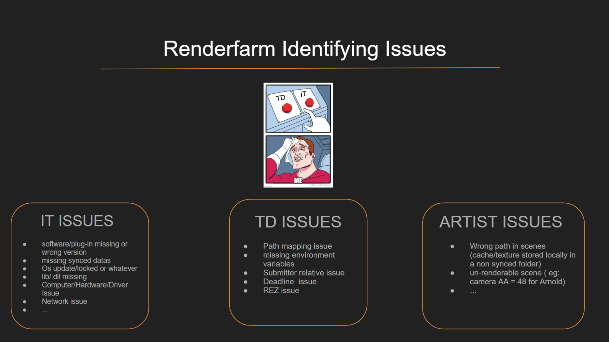
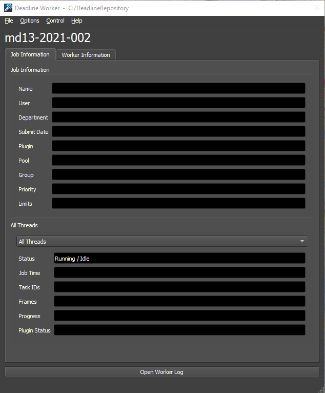

## Vocabulary
Before we dive into using Deadline, let's familiarize ourselves with a few key terms:
- **Monitor**: The Monitor is Deadline's main graphical interface. It allows you to view, control and manage the entire rendering process. You'll find information on jobs in progress, rendering machines, tasks and more.

- **Worker**: A Worker is a machine on which rendering tasks are performed. Each Worker is a resource contributing to the renderfarm. It can be a local or remote machine.
- **Job**: A job represents a unit of work to be performed on the renderfarm. It is a collection of tasks associated with a specific set of rendering parameters.
- **Task**: A task is a specific unit of work within a job. A Job can contain several tasks, each corresponding to a portion of the overall rendering.
- **Submit**: The action of send jobs on the renderfarm.
- **Submitter**: The interface you will use to submit your jobs.

**Example** : I am in my lighting scene for the shot s01_p010. I use the **submitter** to **submit** my render, frame 1001 to 1090 with a **task** size of 10. When it's done, I will see on my **monitor** my **job** "tespipe_s01_p010_lighting" with 9 **tasks** with 10 frames each. (a **task** for frame 1001-1010, another for 1011-1020, etc.) This **tasks** will be dispatched on several active **workers** on the farm. 

## Interface
As a 5th year student, you have access to two interfaces to manage the farm. The Deadline **Monitor** and the Deadline **Worker**.
### Deadline Monitor
The Deadline Monitor is the main user interface for managing the renderfarm. This is where you can monitor the status of your jobs, add new jobs, manage Workers and view render logs. The Monitor provides a complete overview of the status of your renderfarm.

- 1 : Job list. 
- 2 : The list of tasks for the job you have selected. Red : failed, blue : succes, orange : pending, grey : suspended, green : rendering.
- 3 : Worker list with their status, informations etc.

#### Read the logs
If your job fails, before asking the TDs what's going on, check the logs. To do this, select the job or task that failed and press [ctrl] + [I]. 
Depending on the type of error detected by the logs (look for the 'ERROR' line), contact the appropriate department in accordance with the image below:

#### Check your render
When your files have been rendered, you can go directly to the folder where they are located by selecting the job and pressing [ctrl] + [O]. 

### Deadline Worker
The Deadline Worker is the application running on each machine participating in the renderfarm as a Worker. It is the tool that actually performs the rendering tasks assigned by the Deadline Monitor.
                  
If you want to add your computer in the farm, open your worker. If you don't want a rendering to run on your machine, simply close it.