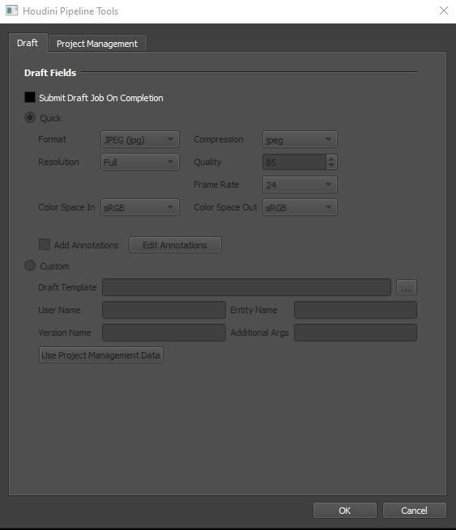
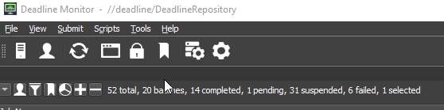
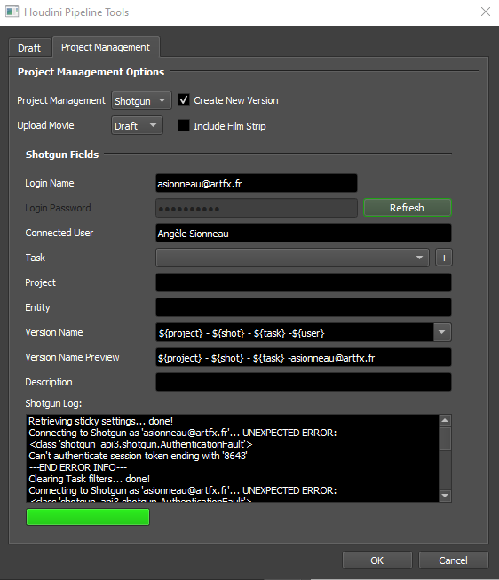

The Pipeline Tools button in the submitter gives access to two pipeline tools: **Draft** and **Shotgun**. If you want to use them, you need to set their parameters before submitting your jobs.
## Draft
Draft is a small Python library that converts your .exr files into .mov video.
                 
To activate it, you need to toggle *Submit Draft Job On Completion*. Once all your .exr files have been rendered, a job draft will automatically be created to convert them to movie format. Overall, you can leave the settings as they are. 
## Shotgun
The shotgun tool will convert your .exr files into movies, then upload them to shotgrid at the task you've selected.
### Before using it
Before using this tool, you need to create your legacy login in shotgrid by following this [tutorital](https://www.cinesync.com/manual/latest/ShotGrid_Username_Login.html). When it's done, you can verify if the connection is working by using the *Testing Integration Connection* script in the Deadline Monitor : 

### Set Shotgun tool
               
Now that you've got your login details, you need to log into the Project Management tab of Pipeline Tools. Activate *Create New Version* and select Draft in *Upload Movie*.                                                
                                      
Next, you need to choose the shotgrid task to which you want to send the movie. For the task to appear in the list, you must be assigned to it on shotgrid and the task must be activated (a status other than NA or Pending Review).
Finally, click on OK.
⚠ Don't forget to activate the Draft job before!⚠

That's it, when your first jobs will be completed, a draft job will be created to convert your .exr into a movie, then a shotgun job will send it to shotgrid and modify the status of your task by "Pending Review".