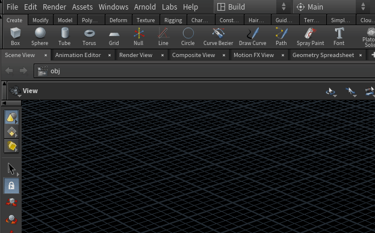
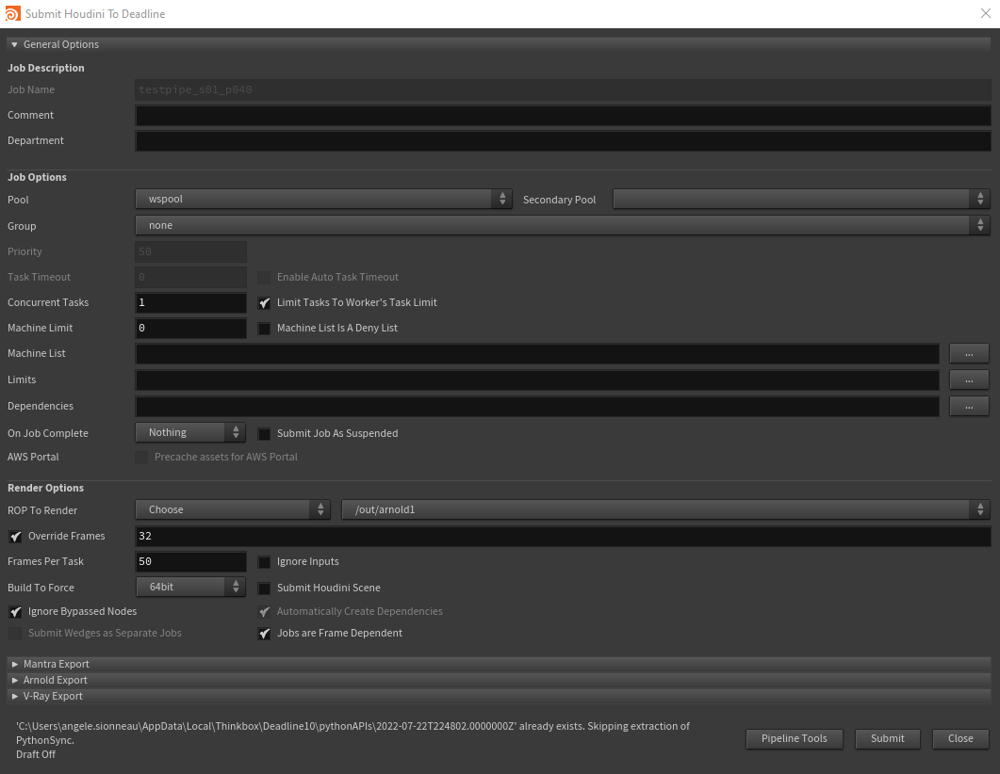
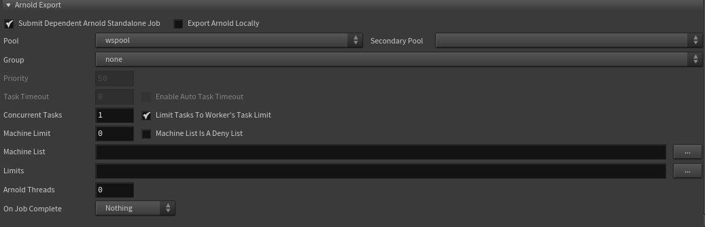
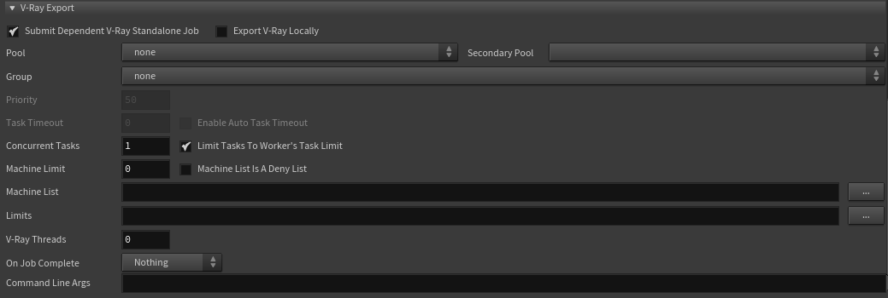
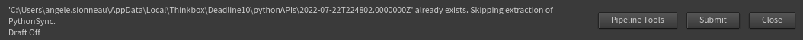

You can access the submitter deadline from houdini if you open houdini from silex.
Before submitting, don't forget to [publish](../basic-concepts/actions/publish.md) your scene.                              
## Acces
                  
To acces the submitter, go to Render>Render to Deadline
## Interface
### General options

- **Job Description** : 
    - *Job name* is automatically set by silex. 
    - But you can add some comment and description in *Comment* and *Department*. This texts will show up in the deadline Monitor.
- **Job options** : 
    - *Pool* and *Group* allow you to specify on which machines you want to run jobs. If you want to send to the whole farm, just leave "wspool" in the pool. Otherwise, specify a secondary pool and/or a worker group.
    - *Priority* is automatically set to 50 by Silex.
    - *Task Timeout* is 90 minutes. Above that, your job will be auto-killed.
- **Render options** : 
    - In *Rop To render*, you can choose wich ROP you want to render (you can choose several ROP in a same submit). 
    - *Override Frames* allows when toggled to specify a frame range. If it is disable, the rop frame range will be used instead. 
    - *Frames Per Task* is how many frames each tasks will render.

### Arnold Export

If *Submit Dependant Arnold Standalone Job* is enable, I first job will be send to export your render as .ass files. Then, another job dependent on the first will render the .exr from the .ass. ⚠ Don't forget to activate .ass render in your arnold ROP before!⚠

### Vray Export

If *Submit Dependant V-Ray Standalone Job* is enable, I first job will be send to export your render as .vrscene files. Then, another job dependent on the first will render the .exr from the .vrscene. ⚠ Don't forget to activate .vrscene render in your vray ROP before!⚠

### Submit

- The button *Pipeline Tools* enables automatic sending of your job results in a .mov file to shotgrid. [More infos here](pipeline_tools.md).
- *Submit* will send yours jobs on the renderfarm!
- Press *Close* cancel process, no job will be submitted.