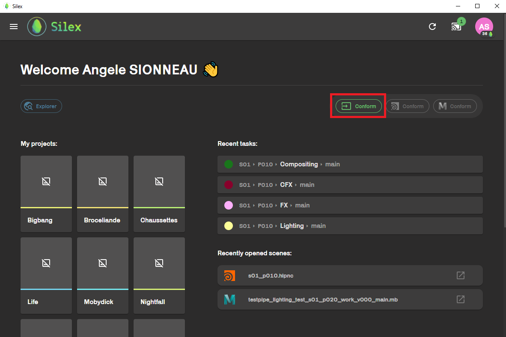
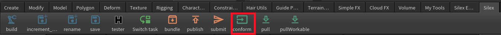
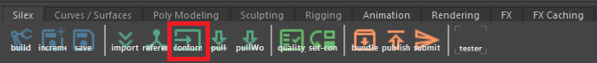
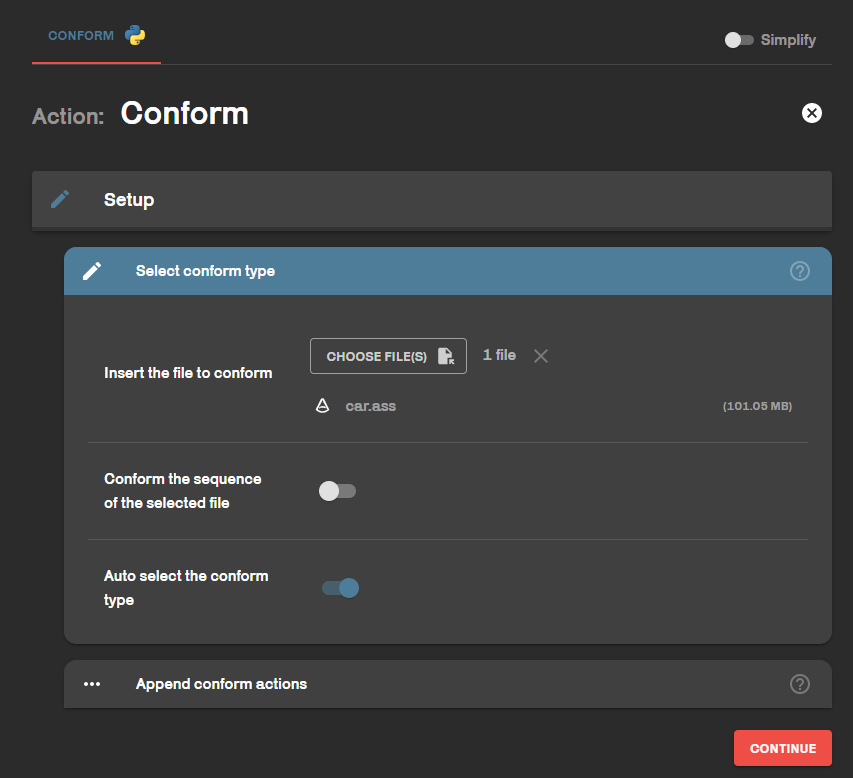

To conform = Include your scenes and assets in the pipeline. This action rename you file and put it in the right folder. **It does not run any quality checks or check dependencies.**

## In Silex

Conform button is in the home page.

## In houdini

Conform button is in the silex shelf.

## In Maya

  
Conform button is in the silex shelf.

## Action

  
When you click on conform button, you are simply asked which file you want to conform. Then, to wich shot or asset your want to link it.
If **Auto select the conform type** is enable, Silex will automatically set your file according to its extension. But if you have any bugs, please disable it.

## Backup scene with conform

You can use the conform action to simply send your scenes to the server for a quick backup.
If your file format is not supported by silex (.ma, .hip, .nk, .ztl, etc.), you can use the **backup** conform type. This will create a backup/<conform name\> folder and put your file in it.
:::note
This type of conform executes no quality checks, checks no dependencies, etc. All it does is copy your file to the right place on the server with the right nomenclature. Use it only if you want to have a copy of your scene backed up on the server.
:::
