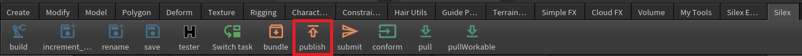
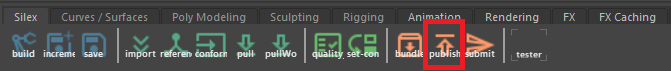
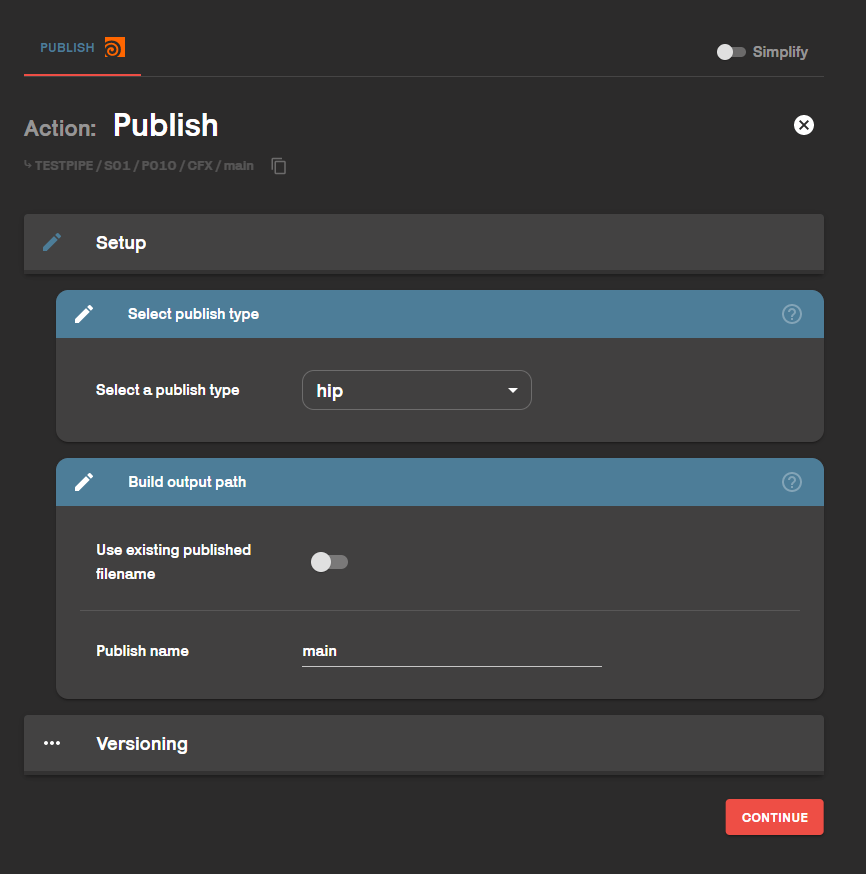
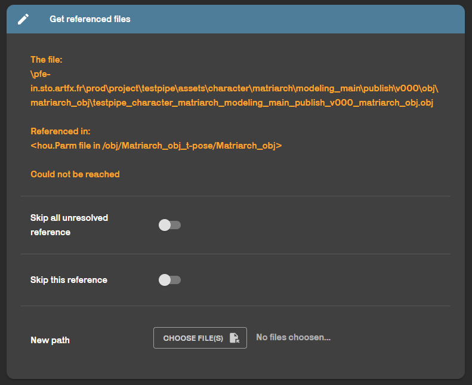
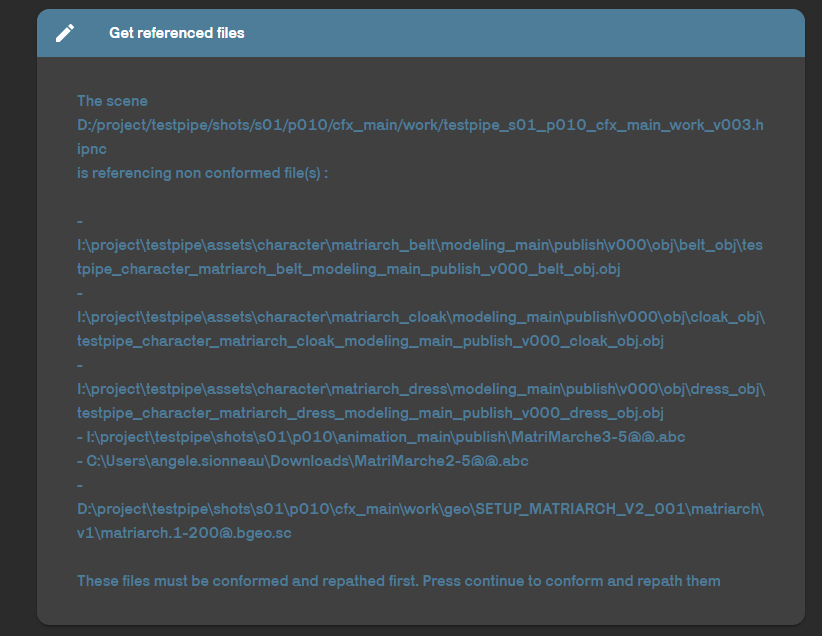
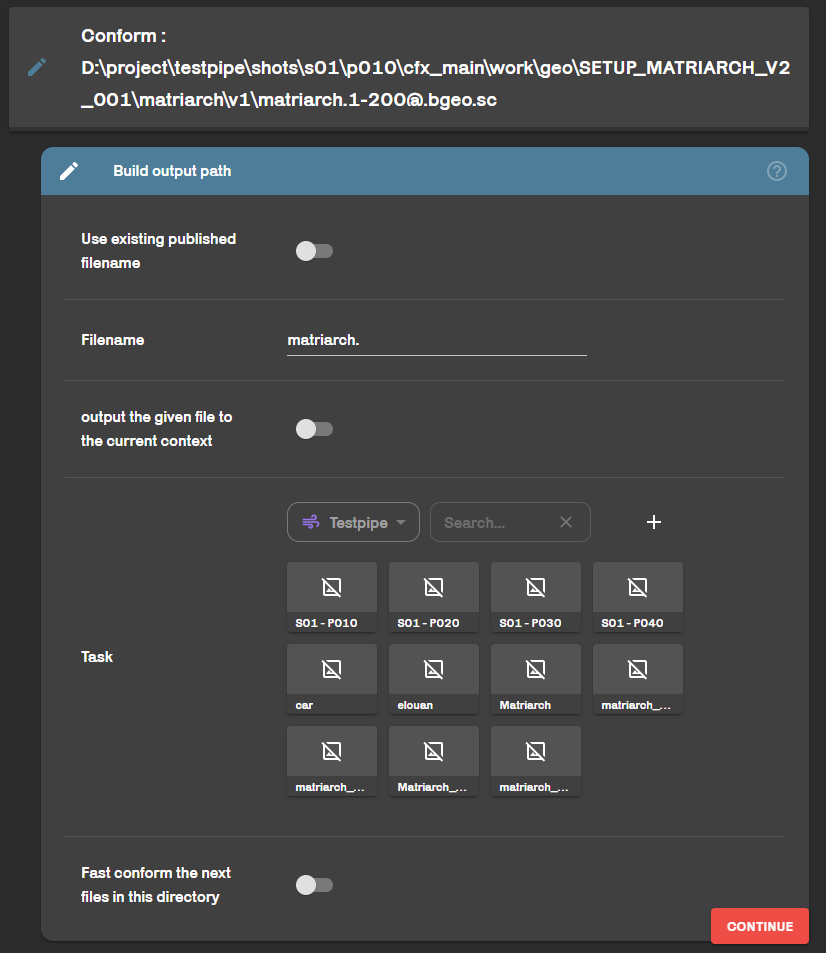

**Publish** is the action of sending a version of your files to a shared space. Basicaly, it's **exporting files for the next step in the pipeline.**
In fact, it's not your work files that will be shared, but a copy or export of them that will be saved on the network.
To use the renderfarm, all you files submitted must have been published.

## In Houdini

From your houdini work file, simply go to the silex shelf and click on the publish button.

Publish type allowed : 
- abc
- ass
- bgeo
- fbx
- hip
- obj
- vdb
- vrscene

## In Maya

From your maya work file, simply go to the silex shelf and click on the publish button.

Publish type allowed : 
- abc
- ass
- bgeo
- fbx
- ma
- obj
- vrmesh
- vrscene
- xgen

## Main publish
When you pushed the publish button, a silex window is supposed to open.

                  
You need to select the **publish type** you want.
In the **Build ouput path** section, you can give a name to your publish. If you don't know how to name it, just stick to "main", it will be fine :smiley:.

## Troubles
### Could not be reached
              
If this message is showing, this means that a file used in the scene you want to publish cannot be found in your project pipe. 
You can choose not to solve the problem by clicking **Skip this reference** if the file is not needed for your publish (old file, unused etc.). Alternatively, you can search for it manually with **New Path**.

:warning: **The file you manually linked must be located on your project's network space. If this is not the case, neither renderfarm nor your colleagues will be able to access it and load the publish correctly.**:warning:

### Not conformed
                 
Here, some files has been found but they are not correctly piped. They need to be conformed.

                
For each file, you must specify what it is. For this example, it's a file cache that I forgot to publish. So I'll give it the name of my filecache (*matriarch*), and I will select which shot it belongs to (*s01-p010*).

**Fast conform** allows you to apply these settings to all other files to be conformed.