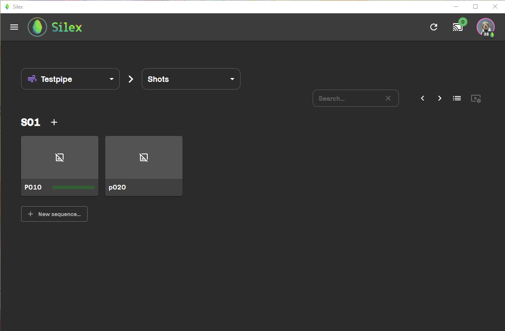
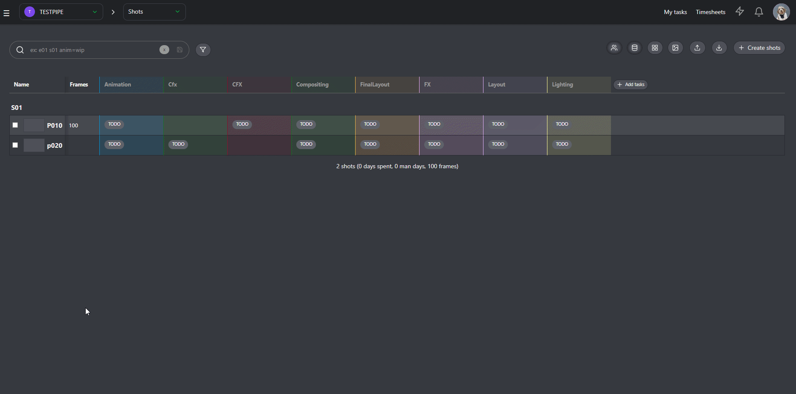
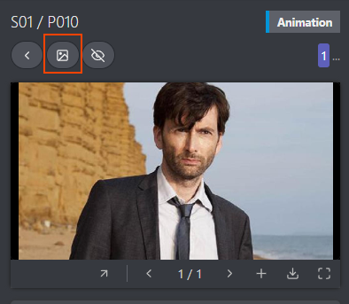
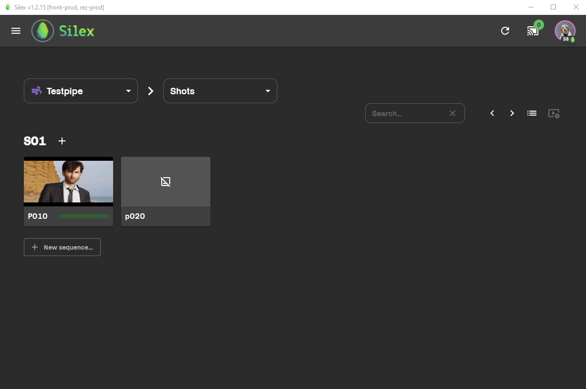

In Silex, thumbnail are automatically generate by the action [publish](../basic-concepts/actions/publish.md).

But, at the beginning, when you've never published before, your [file explorer](../interface/file-explorer.md) will be filled with gray squares. If you'd like to find your way around better and post your own thumbnails, here's how:

1 : Go to your [kitsu](kitsu.md) account.

2 : In the file explorer, go to the asset or shot you want to add a thumbnail. 

3 : Click on the task where you want to add a thumbnail.

4 : Click on the **add a preview to publish** button and select your image.

5 : Finally, to publish it, click on the **Set this preview as thumbnail** button (see screenshot under).

Voila! A thumbnail has been added to your shot or asset!
