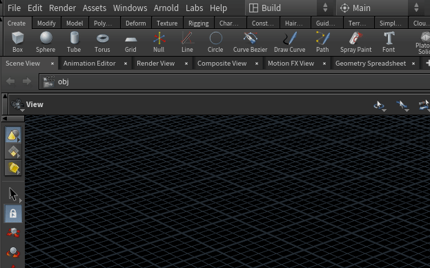
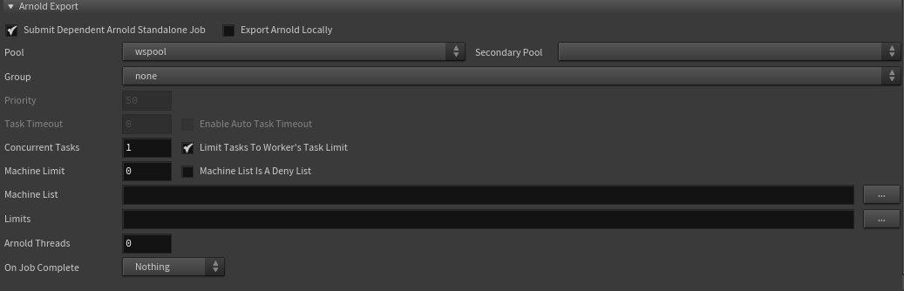
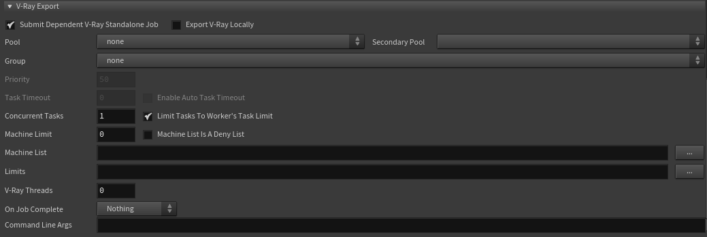
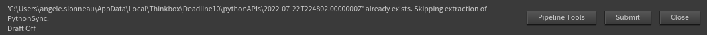

You can access the submitter deadline from houdini if you open houdini from silex.
Before submitting, don't forget to [publish](../basic-concepts/actions/publish.md) your scene.

## Acces

  
To acces the submitter, go to Render>Render to Deadline

## Interface

### General options

- **Job Description** :
  - _Job name_ is automatically set by silex.
  - But you can add some comment and description in _Comment_ and _Department_. This texts will show up in the deadline Monitor.
- **Job options** :
  - _Pool_ and _Group_ allow you to specify on which machines you want to run jobs. If you want to send to the whole farm, set "defaultpool" in pool and "wspool" in secondary pool.
  - _Priority_ is automatically set to 50 by Silex.
  - _Task Timeout_ is 90 minutes per frame. Above that, your job will be auto-killed.
- **Render options** :
  - In _Rop To render_, you can choose wich ROP you want to render (you can choose several ROP in a same submit).
  - _Override Frames_ allows when toggled to specify a frame range. If it is disable, the rop frame range will be used instead.
  - _Frames Per Task_ is how many frames each tasks will render.

### Arnold Export

If _Submit Dependant Arnold Standalone Job_ is enable, I first job will be send to export your render as .ass files. Then, another job dependent on the first will render the .exr from the .ass. ⚠ Don't forget to activate .ass render in your arnold ROP before!⚠

### Vray Export

If _Submit Dependant V-Ray Standalone Job_ is enable, I first job will be send to export your render as .vrscene files. Then, another job dependent on the first will render the .exr from the .vrscene. ⚠ Don't forget to activate .vrscene render in your vray ROP before!⚠

### Submit

- The button _Pipeline Tools_ enables automatic sending of your job results in a .mov file to shotgrid. [More infos here](pipeline_tools.md).
- _Submit_ will send yours jobs on the renderfarm!
- Press _Close_ cancel process, no job will be submitted.
