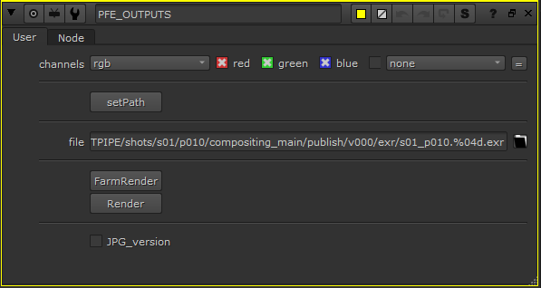
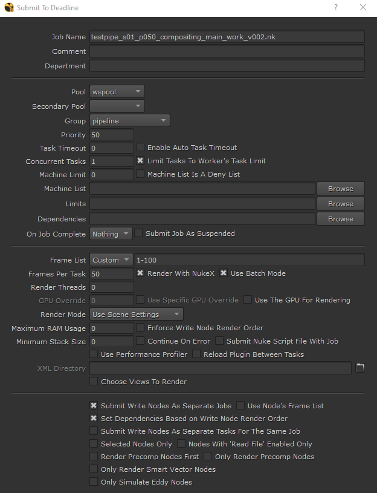

You can access the submitter deadline from nuke if you open nuke from silex.
Before submitting, don't forget to [publish](../basic-concepts/actions/publish.md) your scene.                              
## PFE Writes

                  
When you open nuke from Silex, you have access to a group of "pfe writes" nodes from the Artfx menu.
First of all, click on **Set Path** to obtain the correct output path for your .exr files.
- *FarmRender* opens the submitter for Deadline.
- *Render* run a local render, like the basic write.
- Enabling *JPG_version* will activate a second write that will render .jpg from the .exr.

## Farm Render
Clic on *FarmRender* opens the submitter interface:

- *Job Name*: the name of your job in the Deadline Monitor.
- *Comment* & *Department*: you can write detail to specify your job. Not required.
- *Pool*: set always to **defaultpool** in pool and **wspool** in secondary pool.
- *Group*: You can choose a group of workers if you want to render on a particular group. If you want your jobs to be rendered on the whole farm, choose the group "none".
- *Frame List*: Specify the frame range.

⚠ *Submit Write Nodes As Separate Jobs* ans *Set Dependencies Based on Write Node Render Order* must be **enable**. *Use Node's Frame List* must be **disable**.⚠

### Submit

- The button *Pipeline Tools* enables automatic sending of your job results in a .mov file to shotgrid. [More infos here](pipeline_tools.md).
- *OK* will send yours jobs on the renderfarm!
- Press *Cancel* cancel process, no job will be submitted.